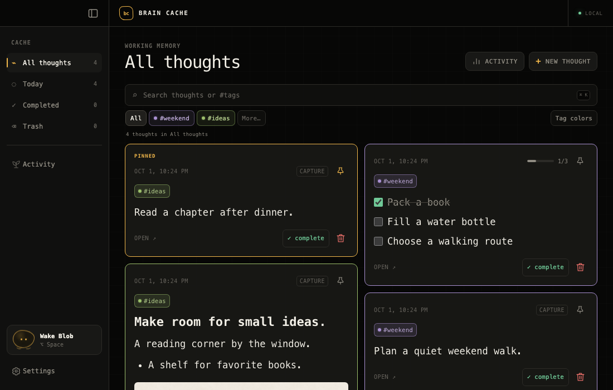
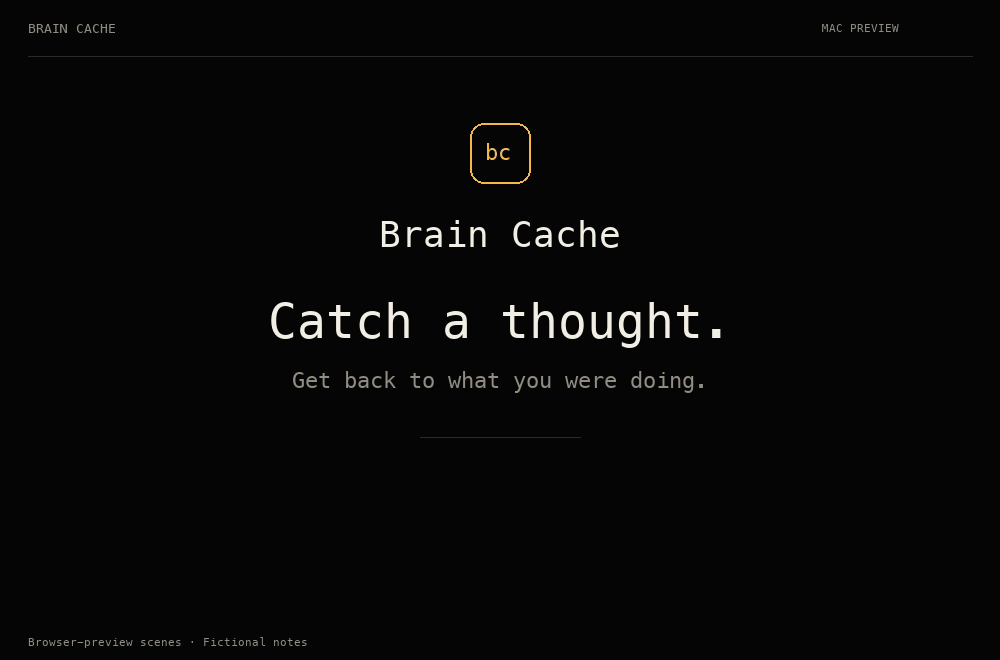
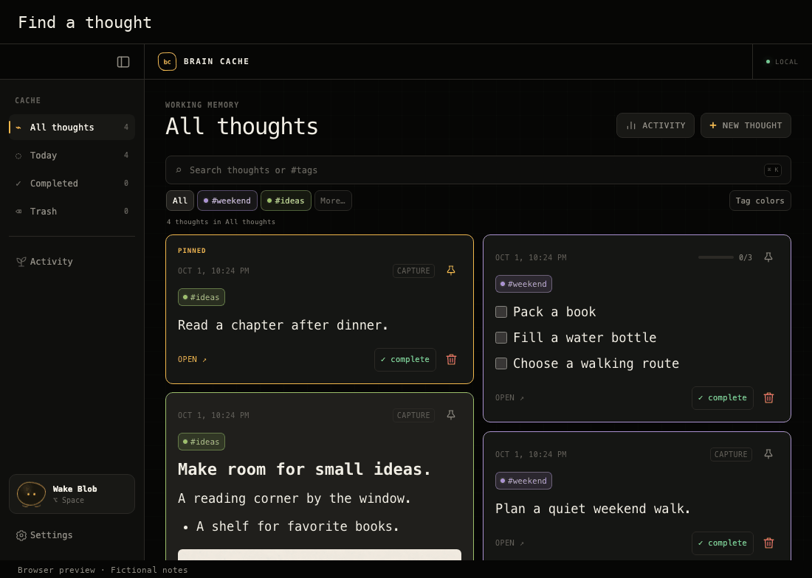
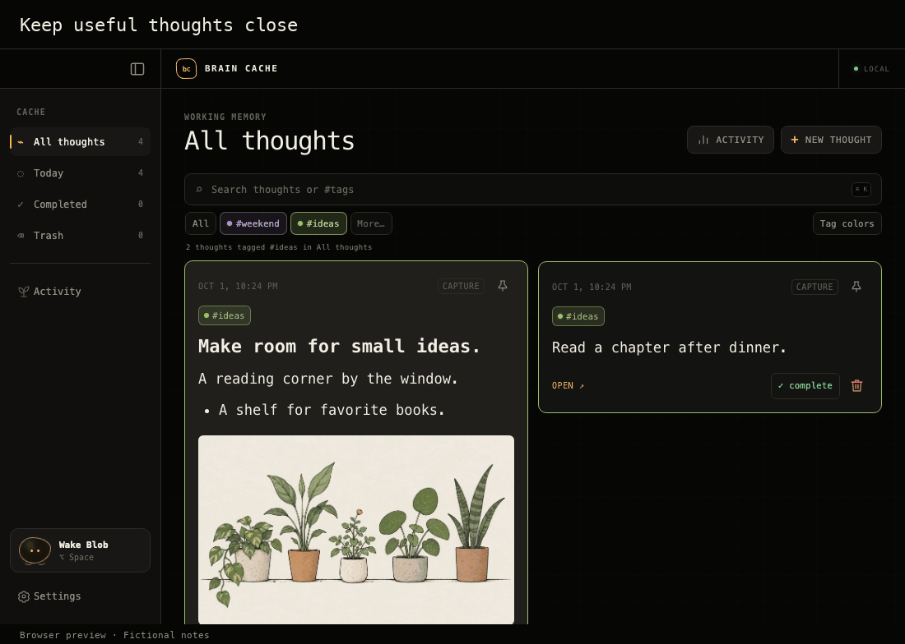
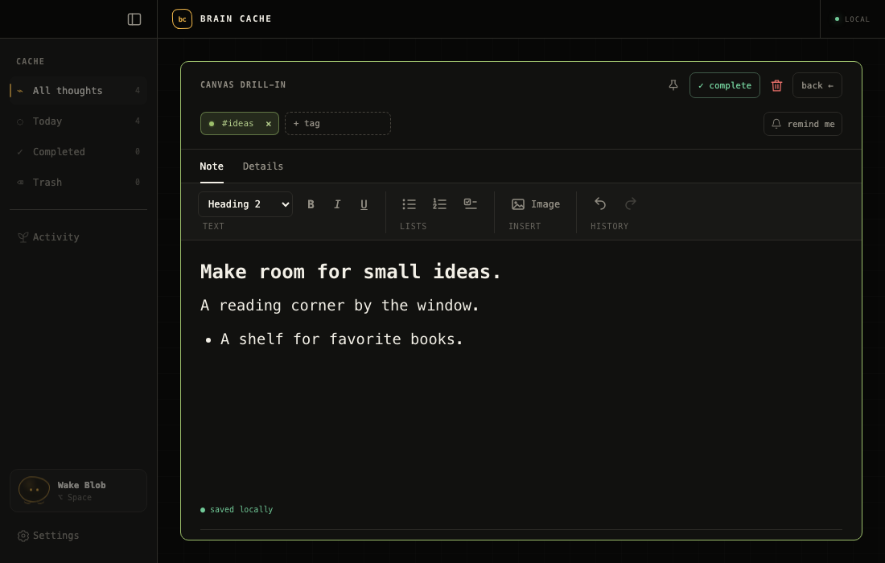
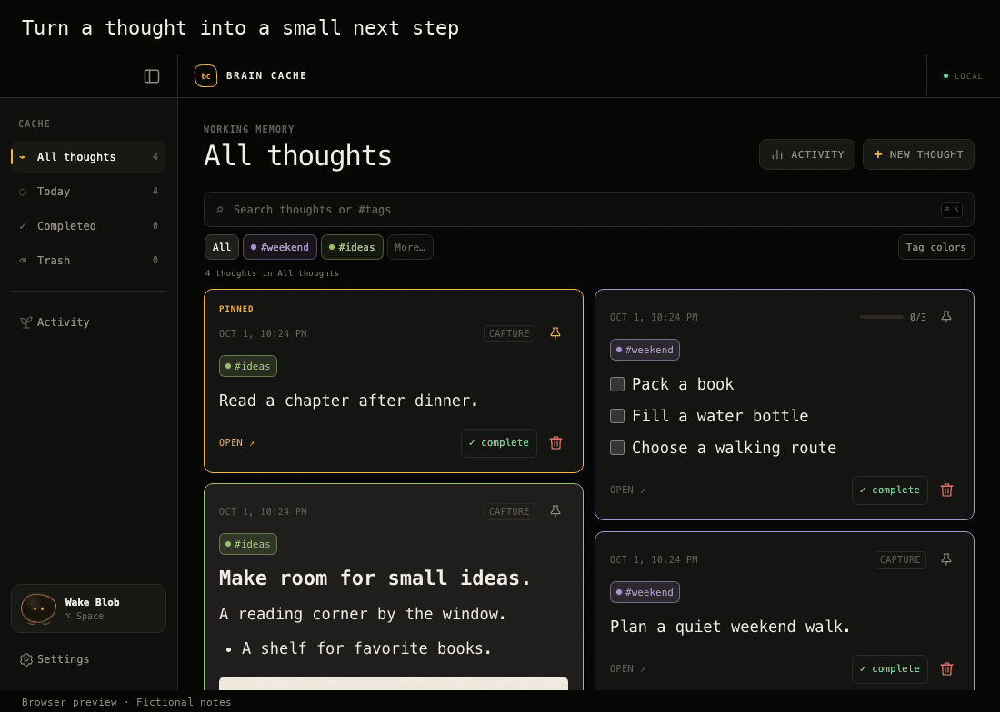
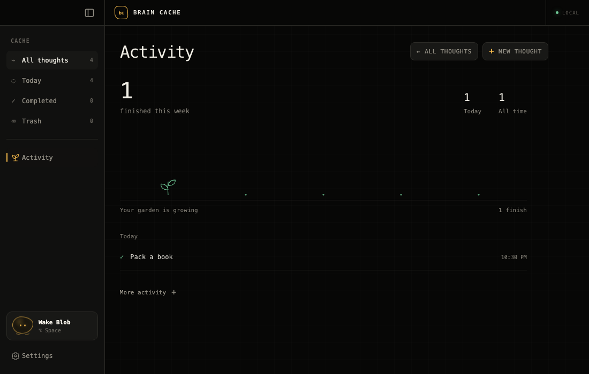
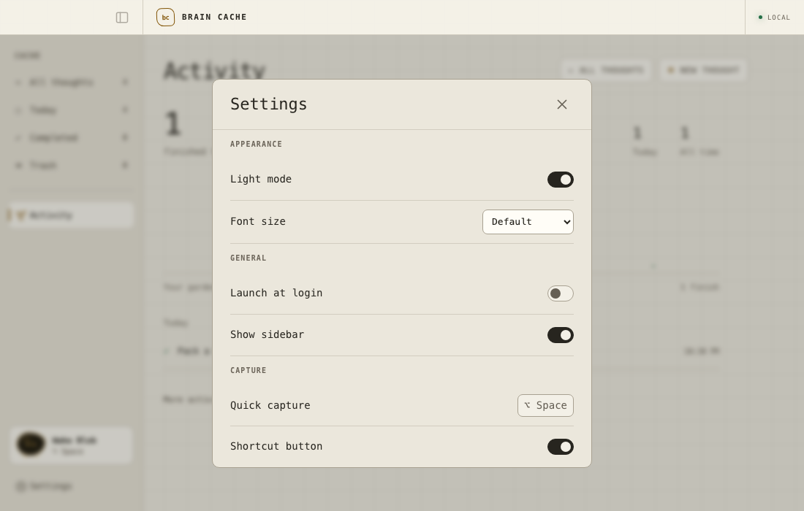

<h1 align="center">Brain Cache</h1>

<p align="center"><strong>Catch a thought. Get back to what you were doing.</strong></p>

<p align="center">
  A private, local-first thought capture app for Mac.<br />
  <strong>⌥ Space</strong> to capture. <strong>⌘ Return</strong> to save.
</p>

<p align="center">
  <a href="docs/screenshots/library.png">
    
  </a>
</p>

<p align="center"><sub>Browser preview with fictional notes.</sub></p>

<p align="center">
  <a href="#building-from-source">Build from source</a> ·
  <a href="#features">Features</a> ·
  <a href="#feature-tour">Feature tour</a> ·
  <a href="#privacy">Privacy</a> ·
  <a href="#contributing">Contribute</a> ·
  <a href="https://discord.gg/3zDAE6hqZ">Discord</a>
</p>

<p align="center"><sub>Mac only · Source preview · MIT licensed</sub></p>

## Features

- **Global quick capture**: summon a focused floating window with **⌥ Space**, save, and return to your work.
- **Local storage**: thoughts and attachments stay on your device. Capture works offline and confirms success only after the local write is verified.
- **Search and tags**: find notes by text or tag, combine them with queries like `meeting #work`, and assign shared tag colors.
- **Rich text notes**: write headings, paragraphs, lists, and checklists with inline images, undo/redo, and automatic local saving.
- **Local attachments**: add files, drag and drop, or paste images. Files are copied into app-managed storage.
- **Checklists and reminders**: check off tasks directly from their cards and set optional reminders for notes or individual items.
- **Pins and collections**: keep useful thoughts at the top and browse All thoughts, Today, Completed, and recoverable Trash.
- **Task activity**: open the Activity garden for local completion counts, recent finishes, and optional history and charts.
- **Settings**: choose light mode and text size, and manage sidebar visibility, shortcut hints, and launch at login.
- **Menu-bar access**: keep Brain Cache nearby, with optional launch at login and a companion that stays quiet until summoned.

See the [feature tour](#feature-tour) for examples you can try.

## Installation

Brain Cache's first public milestone is an early **source-only Mac preview**. To run it, follow [Building from source](#building-from-source) below. **There is no official downloadable installer.** Apple Developer Program membership and signing credentials are not needed to build and use the checked-in local configuration. Signing and notarization are deferred until a later packaged release.

The build targets macOS 13 or later; verified build environments are Apple silicon on macOS 15.7.9 and 26.4. macOS 13 and Intel have not been verified. Windows and Linux are not currently supported targets.

This preview is **Mac only**. Mobile and device sync are outside its scope. Existing mobile code is retained for future development. See the [release plan](RELEASE.md) for source-publication checks and the later installer requirements.

### Permissions and startup

- **Notifications** are requested when you schedule a reminder. Ordinary capture does not require notification permission.
- **Launch at login** is optional and can be enabled in the app. Brain Cache starts quietly with its windows hidden.
- No account, backend service, or API key is needed to use the app.

## Building from Source

### Mac requirements

| Requirement | Version or detail |
| --- | --- |
| macOS | 13 or later is the configured minimum; see the verified environments above |
| Node.js | 22.13 or later |
| pnpm | 11.24.0, matching [`package.json`](apps/mac/package.json) |
| Rust | Rust toolchain with Cargo |
| Apple tools | Xcode Command Line Tools; install with `xcode-select --install` if needed |

The first dependency installation needs a network connection. Capturing thoughts afterward works offline.

### Run the Mac app

```sh
git clone https://github.com/klmrmt/brain-cache.git BrainCache
cd BrainCache/apps/mac
pnpm install --frozen-lockfile
pnpm tauri dev
```

Press **⌥ Space** to start capturing. Click **Brain Cache** in the Dock to browse your library. You can also right-click the menu-bar Blob and choose **Show Library**.

The unbundled development process supports capture and the library. macOS reminders require an application bundle: build the `.app` below and open it to test notifications.

### Build a Mac app and disk image

From `apps/mac`:

```sh
pnpm tauri build
```

The default outputs are in `apps/mac/src-tauri/target/release/bundle/`, including the `.app` and `.dmg`. The checked-in configuration uses ad hoc signing for local builds; it does not produce a notarized public release.

For a clean, checked candidate with version checks, tests, native packaging, and checksums, follow the [verified Mac build procedure](docs/release/building.md). It uses the exact toolchain recorded in the repository.

### Browser preview

For interface development, run this from `apps/mac`:

```sh
pnpm dev
```

Open [localhost:1420](http://127.0.0.1:1420). The preview stores its data in browser local storage, separate from the native app's SQLite database. Use the native app to verify global shortcuts, menu-bar behavior, and macOS notifications.

## How It Works

<p align="center">
  
</p>

*A short product tour. Browser-preview scenes with fictional notes. [View a still image](docs/screenshots/quick-capture.png).*

### Try your first capture

Start with Brain Cache running. If you haven't set it up yet, [build and open the Mac app](#building-from-source).

1. **Open quick capture**

   Hold **Option (⌥)** and press **Space**. A small writing window appears.

2. **Type a thought**

   Try: “Read a chapter after dinner.”

3. **Save and get back to work**

   Hold **Command (⌘)** and press **Return**. The outline briefly turns green to confirm the save, then the capture window disappears. Your thought is stored on your Mac.

4. **Find your thought later**

   Click **Brain Cache** in the Dock. Click the search bar and type **chapter** to find the note you just saved.

Tags, checklists, and files are optional. You can add them when you need them.


### Keyboard shortcuts

Except for the global **⌥ Space** shortcut, these apply within Mac quick capture.

| Shortcut | Action |
| --- | --- |
| **⌥ Space** | Open quick capture |
| **⌘ Return** | Save the thought |
| **⌘ T** | Open tags |
| **⌘ ⇧ 7** | Start a numbered list |
| **⌘ ⇧ 8** | Start a bulleted list |
| **⌘ ⇧ 9** | Toggle checklist mode |
| **Hold ⌘** | Preview shortcut help |
| **⌘ ?** | Toggle shortcut help |
| **Escape** | Dismiss shortcut help or tags first, then capture |

## Feature Tour

These examples were recorded in the browser preview with fictional notes. Preview storage is separate from the Mac app.

### 1. Find a thought with search and tags

Type **chapter** to find the sample reading note. Add **#ideas** to narrow the search: `chapter #ideas`.



[View a still image](docs/screenshots/feature-search.png).

<details>
  <summary>2. Keep important thoughts at the top</summary>

Click a card's **pin icon** to keep it with your pinned thoughts at the top. Click it again to unpin.



[View a still image](docs/screenshots/feature-pins.png).

</details>

<details>
  <summary>3. Give a note more room</summary>

Open a thought, then **expand** it. Use the toolbar for headings, lists, and inline images. Edits save automatically.



Try the [fictional plant illustration](docs/examples/README.md) when exploring image attachments.

</details>

<details>
  <summary>4. Check off a task and see your progress</summary>

Check off a task on its card, then open **Activity** in the sidebar to see the completion recorded.



[View a still image](docs/screenshots/activity-garden.png).

</details>

<details>
  <summary>5. Watch your Activity garden grow</summary>

The garden grows with completed checklist tasks. **More activity** opens history and charts.



</details>

<details>
  <summary>6. Make the app comfortable to read</summary>

Open **Settings** and turn on **Light mode**. Adjust **Font size** for more comfortable reading.



</details>

## Privacy

- **Capture stays local.** Saving thoughts does not require an account or a network connection.
- **Mac storage uses SQLite.** Thoughts and attachment bytes live in `brain-cache.sqlite3` in the app's macOS application-data directory.
- **Reminders use macOS notifications.** Reminder intent is stored locally before system scheduling, with permission requested only when needed.
- **Files are copied, not just linked.** Attachments support up to 20 MB per file, 20 files per thought, and 50 MB total per thought.

With the checked-in Mac app identifier, the default database location is:

```text
~/Library/Application Support/com.braincache.desktop/brain-cache.sqlite3
```

Follow the [Mac backup and restore guide](docs/release/backup-restore.md) to create a verified recovery copy without losing SQLite WAL data.

Device sync is outside the current release. Any future synchronization must preserve the rule that a thought is saved on the originating device first.

## Community

Join the [Brain Cache Discord](https://discord.gg/3zDAE6hqZ) to ask questions, share feedback, and discuss ideas with other users and contributors.

For bug reports and feature requests, use [GitHub Issues](https://github.com/klmrmt/brain-cache/issues) so they are easy to track.

## Contributing

Bug reports, documentation improvements, and focused pull requests are welcome. Start with the [contributor guide](CONTRIBUTING.md), then use [GitHub Issues](https://github.com/klmrmt/brain-cache/issues) to report a problem or discuss a larger change. Follow the [security-reporting instructions](SECURITY.md) for suspected vulnerabilities.

1. Fork the repository and create a branch for your change.
2. Read [AGENTS.md](AGENTS.md) for the development workflow, [ARCHITECTURE.md](ARCHITECTURE.md) for system boundaries, and [DESIGN.md](DESIGN.md) before making interface changes.
3. Make a focused change and add tests for behavior changes. Preserve local capture and compatibility with existing saved thoughts.
4. Run the relevant checks and open a pull request explaining what changed, why, and how you verified it.

For bug reports, include your operating-system version, how you ran the app, reproduction steps, and expected behavior. Use sample thoughts and attachments in screenshots.

### Verification

For Mac application changes, run these checks from `apps/mac`:

```sh
pnpm test
pnpm build
cargo test --manifest-path src-tauri/Cargo.toml
pnpm tauri build
```

Also exercise the change in the native app and verify that a thought survives capture, save, quit, and relaunch while offline. A browser preview alone does not verify the native app.

For documentation-only changes, check links, paths, and commands, then run `git diff --check`. If you work on the retained mobile code, its separate verification requirements remain in [`apps/ios/README.md`](apps/ios/README.md).

## Project Structure

| Path | Purpose |
| --- | --- |
| [`apps/mac/src`](apps/mac/src) | React and TypeScript interface; `bridge.ts` is the native boundary |
| [`apps/mac/src-tauri`](apps/mac/src-tauri) | Rust/Tauri host, SQLite storage, native windows, shortcuts, and reminders |
| [`apps/ios`](apps/ios) | Retained mobile code and tests; outside the current release |
| [`docs/design`](docs/design) | Feature design notes |
| [`legacy/swift-mac-prototype`](legacy/swift-mac-prototype) | Preserved earlier Mac prototype |

## Documentation

- [Release plan](RELEASE.md): Mac release scope, current evidence, and remaining launch requirements.
- [Verified Mac builds](docs/release/building.md): pinned tools, CI, candidate artifacts, and checksums.
- [Distribution signing](docs/release/signing.md): deferred maintainer certificate setup, notarization, and installer acceptance.
- [Contributor guide](CONTRIBUTING.md): development setup, issue reports, and pull requests.
- [Security reporting](SECURITY.md): private disclosure instructions and current availability.
- [Agent instructions](AGENTS.md): product rules, implementation workflow, and verification requirements.
- [Architecture](ARCHITECTURE.md): platform boundaries, storage, and the shared thought contract.
- [Design system](DESIGN.md): typography, colors, layout, interactions, and Blob's behavior.
- [Feature backlog](FEATURE_BACKLOG.md): product direction and implementation status.
- [Changelog](CHANGELOG.md): changes across the project.
- [Mobile developer notes](apps/ios/README.md): setup and testing for retained code outside the release scope.

## License

Brain Cache is licensed under the [MIT License](LICENSE). Copyright (c) 2026 braincache.

Third-party dependencies retain their own licenses. See [dependencies and assets](THIRD_PARTY.md) for the current inventory and distribution requirements.

## Acknowledgments

Brain Cache is built with [Tauri](https://tauri.app/), [React](https://react.dev/), [TypeScript](https://www.typescriptlang.org/), [Rust](https://www.rust-lang.org/), [SQLite](https://www.sqlite.org/), and [Tiptap](https://tiptap.dev/).
