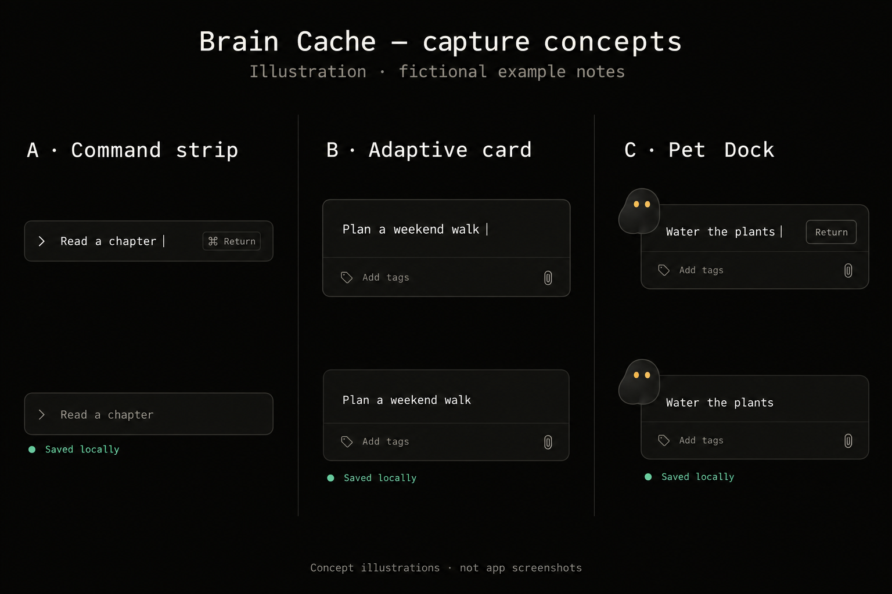

# Compact Capture — Approved Pet Dock Direction

**Status:** Approved for development

**Approved:** 2026-09-02

**Direction:** C — Pet Dock

The comparison image was regenerated on October 1, 2026 with entirely fictional notes and no screenshot references. It is an AI-generated concept illustration, not an app screenshot. The written experience contract defines the approved behavior.

Direction C is the approved direction. Directions A and B remain in the comparison board only as rejected exploration, not implementation alternatives.

## Experience contract

The popup rests at the smallest useful size: one line of thought text, a small docked Blob, and a compact save affordance. It expands downward only when text wraps or the person deliberately opens an optional tool. Capture remains immediately focused, keyboard-native, local-first, and independent of tags or other metadata.

## Resting state

- Target a content frame around `455 × 50` logical pixels. Native transparent padding may extend beyond that frame only far enough to avoid clipping Blob, the focus ring, rounded corners, or the floating-surface shadow.
- Dock a roughly 38 pt Blob badge slightly over the left edge. It stays visually connected to the panel without creating a second container.
- Give the thought field the remaining horizontal space and show one line at rest.
- Place a compact Return-key affordance on the right. Preserve `⌘ Return` as the explicit save shortcut.
- Keep optional tags, labels, local-status copy, and secondary actions out of the resting height.

## Adaptive expansion

- Grow the rounded surface and native window downward as the thought wraps. Never reserve empty multiline rows before they are needed.
- Keep the input focused and the save affordance anchored while height changes.
- Contract again when text is deleted or optional controls close.
- Stay inside the active display's usable bounds. If content reaches that boundary, stop growing and scroll the editor internally.
- Use the existing 120–180 ms functional motion range, honor Reduce Motion, and never delay the first keystroke or local save confirmation.

## Tag shelf and assigned colors

- The existing tag shortcut opens a slim shelf beneath the thought within the same rounded surface. Closing it returns the popup to the smallest height allowed by the current text.
- A tag may have one optional assigned color. Color belongs to the canonical tag and appears consistently in capture, cards, Focus Lens, Canvas Drill-In, suggestions, filters, and search.
- Creating or saving a tag never requires choosing a color. Graphite is the neutral default, and the picker includes a remove-color action.
- Use a compact, keyboard-accessible swatch picker with these approved choices:

| Name | Value |
| --- | --- |
| Graphite | `#7B7972` |
| Clay | `#B98762` |
| Moss | `#879B69` |
| Sky | `#6F9CAE` |
| Plum | `#8B7CAD` |
| Rose | `#A97988` |

- Apply color as a small dot, border, and low-opacity tint. Do not use saturated filled chips or color alone to communicate tag identity.
- Keep Signal amber, Saved green, and Error red reserved for their existing semantic meanings.

## Surface and behavior constraints

- Present exactly one 14 pt-radius floating surface with transparent native chrome around it. A rectangular black window backdrop must never be visible.
- Open near the upper-left of the active display and remain fully inside its usable area as the popup grows.
- Preserve autofocus, keyboard tagging, `⌘ Return` save, local saved/error feedback, `Escape` dismissal, and offline persistence.
- Blob remains silent unless the person asks it a question.

## Implementation slices

- `BC-010` owns the Pet Dock layout, adaptive native-window sizing, tag shelf, motion, and capture regression coverage.
- `BC-011` owns canonical tag color storage, migration, editing, cross-surface rendering, accessibility, and focused tests.

Keeping these slices separate prevents optional color metadata from delaying the smaller capture experience.
