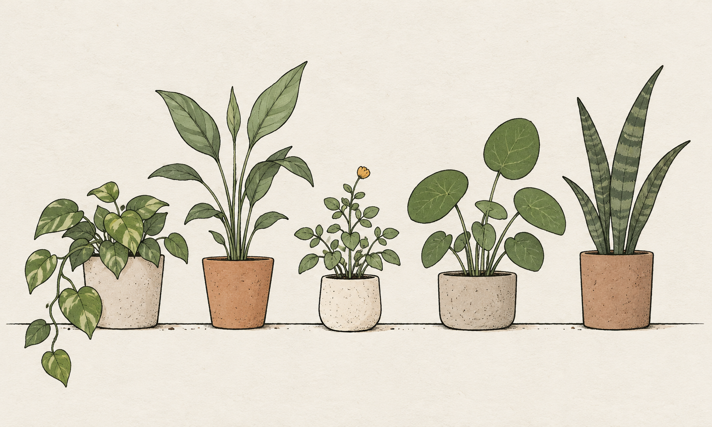

# Fictional example material

These images and notes are examples created for this project. They contain no real person's thoughts, screenshots, contact details, or work tasks.

## Example attachment

An example note to accompany the image:

> A little reading corner. Try a small plant beside the window and leave room for a book.

The plant study is an AI-generated illustration, not a photo or app screenshot. It can be used as a synthetic image attachment when demonstrating capture and note editing. Do not imply that the pictured plants or note belong to a real person.

The [capture concept board](../design/compact-capture-directions.png) is also generated from fictional notes. The README's interface screenshots are browser-preview captures made with synthetic data. See [asset provenance](../release/asset-provenance.md) for origin, prompts, and reuse limits.
